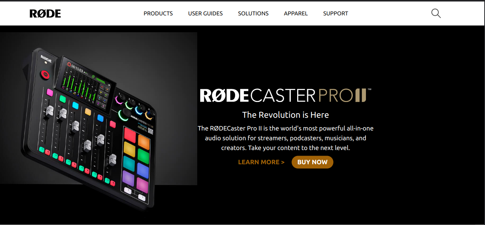

# Rode Project

### `Author` : **Rushikesh Dhanawade**

Made with ❤ in india

This is the User-Interface of Rode website designed fully with HTML and Tailwind CSS. The Landing page contains:

- Nabar
- Main Section

# Learning Outcomes

- Handling background image.
- styling webpages using (only Tailwind).

<!-- # Preview -->

# Time taken to Complete

`6 hours`

# you can see Live here 😎

## 👉 [LIVE](https://rushi-rode.netlify.app/) 👈